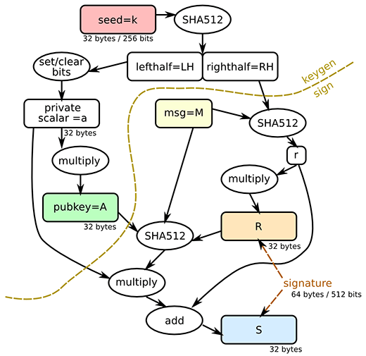

# Ed25519 Algorithm Implementation

This document provides an overview of the Ed25519 algorithm implementation in Python. The Ed25519 algorithm is used for digital signatures and is known for its high performance and security.



## Parameters

- **seed(k)**: A random 32-byte value. This value is the core of encryption and forms the left half of the private key.
- **pubkey(A)**: The public key. It serves as the user's address and forms the right half of the private key in the Ed25519 encryption algorithm.
- **msg(M)**: The message that needs to be signed.
- **R**: The left half of the signature, representing the signature's random value.
- **S**: The right half of the signature, representing the signature verification data.

## Constants

```python
import hashlib

b = 256  # Bit length
q = 2**255 - 19  # Prime number q
l = 2**252 + 27742317777372353535851937790883648493  # Prime number l
```

## Hash Function

```python
def H(m):
    """
    Compute the SHA-512 hash of the given message.

    Parameters:
    m (bytes): The message to hash.

    Returns:
    bytes: The SHA-512 hash of the message.
    """
    return hashlib.sha512(m).digest()
```

## Modular Exponentiation

```python
def expmod(b, e, m):
    """
    Compute (b^e) % m using the recursive fast exponentiation algorithm.

    Parameters:
    b (int): Base
    e (int): Exponent
    m (int): Modulus

    Returns:
    int: The result of (b^e) % m
    """
    if e == 0:
        return 1
    t = expmod(b, e // 2, m) ** 2 % m
    if e & 1:
        t = (t * b) % m
    return t
```

## Modular Inverse

```python
def inv(x):
    """
    Compute the modular inverse of x under modulo q.

    Parameters:
    x (int): The integer to invert.

    Returns:
    int: The modular inverse of x.
    """
    return expmod(x, q - 2, q)
```

## Constants d and I

```python
d = -121665 * inv(121666)  # Constant d
I = expmod(2, (q - 1) // 4, q)  # Constant I
```

## Recover x Coordinate from y Coordinate

```python
def xrecover(y):
    """
    Recover the x coordinate from the given y coordinate.

    Parameters:
    y (int): The y coordinate.

    Returns:
    int: The recovered x coordinate.
    """
    xx = (y * y - 1) * inv(d * y * y + 1)
    x = expmod(xx, (q + 3) // 8, q)
    if (x * x - xx) % q != 0:
        x = (x * I) % q
    if x % 2 != 0:
        x = q - x
    return x
```

## Base Point B

```python
By = 4 * inv(5)  # y coordinate of base point B
Bx = xrecover(By)  # x coordinate of base point B
B = [Bx % q, By % q]  # Base point B
```

## Point Addition on Edwards Curve

```python
def edwards(P, Q):
    """
    Perform point addition on the Edwards curve.

    Parameters:
    P (tuple): The first point (x1, y1).
    Q (tuple): The second point (x2, y2).

    Returns:
    list: The resulting point (x3, y3).
    """
    x1, y1 = P
    x2, y2 = Q
    x3 = (x1 * y2 + x2 * y1) * inv(1 + d * x1 * x2 * y1 * y2)
    y3 = (y1 * y2 + x1 * x2) * inv(1 - d * x1 * x2 * y1 * y2)
    return [x3 % q, y3 % q]
```

## Scalar Multiplication

```python
def scalarmult(P, e):
    """
    Perform scalar multiplication e * P.

    Parameters:
    P (list): A point on the elliptic curve [x, y].
    e (int): The scalar.

    Returns:
    list: The resulting point Q [x, y].
    """
    Q = [0, 1]  # Initialize to the point at infinity
    while e > 0:
        if e & 1:
            Q = edwards(Q, P)
        P = edwards(P, P)
        e //= 2
    return Q
```

## Encode Integer to Bytes

```python
def encodeint(y):
    """
    Encode an integer as a byte sequence.

    Parameters:
    y (int): The integer to encode.

    Returns:
    bytes: The encoded byte sequence.
    """
    bits = [(y >> i) & 1 for i in range(b)]
    return bytes([sum([bits[i * 8 + j] << j for j in range(8)]) for i in range(b // 8)])
```

## Encode Point to Bytes

```python
def encodepoint(P):
    """
    Encode a point P as a byte sequence.

    Parameters:
    P (tuple): A tuple containing two integers (x, y) representing the point.

    Returns:
    bytes: The encoded byte sequence.
    """
    x, y = P
    bits = [(y >> i) & 1 for i in range(b - 1)] + [x & 1]
    return bytes([sum([bits[i * 8 + j] << j for j in range(8)]) for i in range(b // 8)])
```

## Get Bit from Hash

```python
def bit(h, i):
    """
    Return the value of the i-th bit in the byte array h.

    Parameters:
    h (bytes): The byte array.
    i (int): The bit index.

    Returns:
    int: The value of the bit (0 or 1).
    """
    return (h[i // 8] >> (i % 8)) & 1
```

## Generate Public Key

```python
def publickey(sk):
    """
    Generate the public key for the given private key.

    Parameters:
    sk (bytes): The private key.

    Returns:
    bytes: The public key.
    """
    h = H(sk)
    a = 2 ** (b - 2) + sum(2 ** i * bit(h, i) for i in range(3, b - 2))
    A = scalarmult(B, a)
    return encodepoint(A)
```

## Compute Hash of Message

```python
def Hint(m):
    """
    Compute the hash of the message m and return the weighted sum of the bits.

    Parameters:
    m (str): The input message.

    Returns:
    int: The weighted sum of the hash bits.
    """
    h = H(m)
    return sum(2 ** i * bit(h, i) for i in range(2 * b))
```

## Generate Signature

```python
def signature(m, sk, pk):
    """
    Generate an Ed25519 signature.

    Parameters:
    m (bytes): The message to sign.
    sk (bytes): The private key.
    pk (bytes): The public key.

    Returns:
    bytes: The signature, consisting of R and S.
    """
    h = H(sk)
    a = 2 ** (b - 2) + sum(2 ** i * bit(h, i) for i in range(3, b - 2))
    r = Hint(h[b // 8 : b // 4] + m)
    R = scalarmult(B, r)
    S = (r + Hint(encodepoint(R) + pk + m) * a) % l
    return encodepoint(R) + encodeint(S)
```

## Check if Point is on Curve

```python
def isoncurve(P):
    """
    Check if the given point P is on the curve.

    Parameters:
    P (tuple): A tuple containing the x and y coordinates of the point.

    Returns:
    bool: True if the point is on the curve, False otherwise.
    """
    x, y = P
    return (-x * x + y * y - 1 - d * x * x * y * y) % q == 0
```

## Decode Integer from Bytes

```python
def decodeint(s):
    """
    Decode an integer from a byte sequence.

    Parameters:
    s (bytes): The byte sequence to decode.

    Returns:
    int: The decoded integer.
    """
    return sum(2**i * bit(s, i) for i in range(0, b))
```

## Decode Point from Bytes

```python
def decodepoint(s):
    """
    Decode a point from a byte sequence.

    Parameters:
    s (bytes): The byte sequence to decode.

    Returns:
    list: The decoded point [x, y].

    Raises:
    Exception: If the decoded point is not on the curve.
    """
    y = sum(2**i * bit(s, i) for i in range(0, b - 1))
    x = xrecover(y)
    if x & 1 != bit(s, b - 1):
        x = q - x
    P = [x, y]
    if not isoncurve(P):
        raise Exception("Decoding point that is not on curve")
    return P
```

## Verify Signature

```python
def checkvalid(s, m, pk) -> bool:
    """
    Verify the given signature.

    Parameters:
    s (bytes): The signature, should be of length b // 4.
    m (bytes): The message.
    pk (bytes): The public key, should be of length b // 8.

    Returns:
    bool: True if the signature is valid, False otherwise.

    Raises:
    Exception: If the signature length or public key length is incorrect.
    Exception: If the signature verification fails.
    """
    if len(s) != b // 4:
        raise Exception("Signature length is wrong")
    if len(pk) != b // 8:
        raise Exception("Public-key length is wrong")
    R = decodepoint(s[: b // 8])
    S = decodeint(s[b // 8 : b // 4])
    A = decodepoint(pk)
    h = Hint(encodepoint(R) + pk + m)
    if scalarmult(B, S) != edwards(R, scalarmult(A, h)):
        raise Exception("Signature does not pass verification")
    return True
```

This implementation provides the basic functions needed to work with the Ed25519 algorithm, including key generation, signing, and verification.
